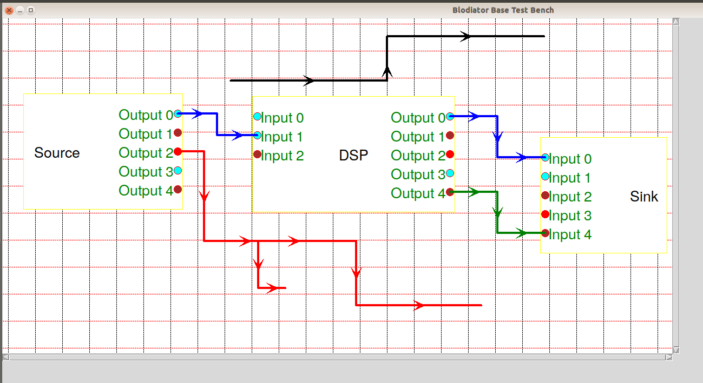

# Blodiator
Block diagram editor for graphical UI simulators and processing applications

BLOck DIAgram ediTOR (Blodiator) is a package to create block diagrams for free-space optical (FSO) communication system simulator. The package alows basic operation including creating block diagrams, storage management, verification and preparation for execution. All the block diagram items are customisable through **XML** files available in folder **config**. The GUI is all done using tkinter package.

Install the package by cloning the files or by creating the wheel package and pip. For further information see:
[Generating distribution archives](https://packaging.python.org/tutorials/packaging-projects/)

After installation, to use the package, import the following packages:
<pre><code>from blodiator.etc import coloredtext
from blodiator import blodiatorbase</code></pre>

Then create a console object using **ColoredText**:
<pre><code>console = coloredtext.ColoredText()</code></pre>

The same as any **tkinter** application, create a tk application:
<pre><code>app = tk.Tk()
app.geometry("{0}x{1}".format(window width, window height))
app.title('window title')</code></pre>

Then create an instance of **blodiatorbase** and pass the appliation and console objects as arguments:
<pre><code>TestApp = blodiatorbase.BlodiatorBase(master=app, std=console)</code></pre>

And lastly, excecute the main loop of the application:
<pre><code>app.mainloop()</code></pre>

Basically, blocks are placed on the canvas and connected by using connectors. In case needed, a node is added automatically to create extensions. In this package 4 different signal type are defined as 'none', 'logical', 'electrical', and 'optical' and depending on the port types of the block the color of connectors are set automatically. 

The available config xml files are:

- **Block_Types.xml**: defines all available blocks as well as associated definition files.
- **BlockProperty.xml**: defines all properties of block items.
- **ConnectorProperty.xml**: defines all properties of connector items.
- **NodeProperty.xml**: defines all properties of node items.

Creation of block diagrams and controlling the functionality of the diagram editor is done by shortkeys. A list of shortkeys with a brief explanation is given as follows:

| Command | Description |
| --- | --- |
| n | new block diagram file |
| w | write block diagram to file |
| r | read block diagram from file |
| e | edit property of the block |
| l | select block type |
| v | verify the block diagrams |
| u | prepare the block diagrams for execution |
| b | place a block on canvas |
| c | place a connector on canvas |
| d | remove item(s) from canvas |
| m | move item(s) on canvas |
| g | toggle the guidelines |
| s | toggle snap mode |
| p | print out the existing items |
| esc | cancel ongoing operation |

## Blodiator

